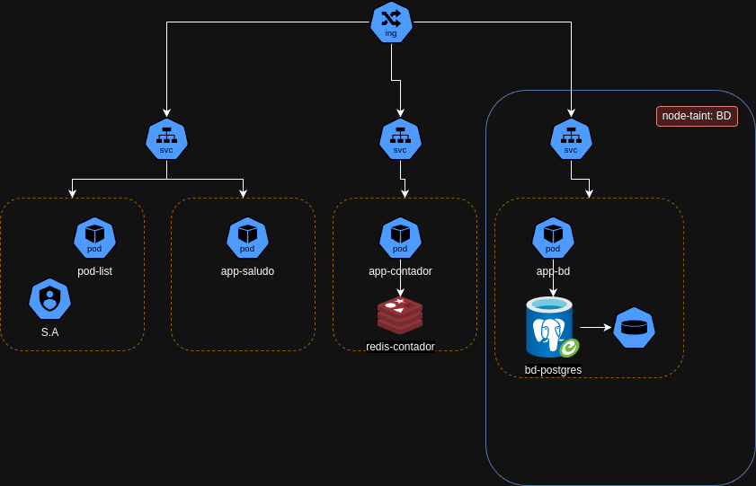

## Consigna TP Final

Se presenta a continuación un driagrama de "intencion" de proyecto. Es decir, no es una arquitectura final a seguir rigidamente. Es mas bien una muestra de las aplicaciones que quiero correr, y algunas features que cada una debe contener.

A notar:

- Aplicacion "pod-list" debe tener correctamente configurada su Service account (El codigo de la aplicación le será provisto en futuras clases)

- App-db: Debe persisitir datos y correr en un nodo reservado exclusivo para si mismo. Esta aplicación es la que se dió como tarea en la clase 1.

Se Solicita (no necesariamente en este orden):

1- Realizar un diagrama de arquitectura definitivo

2- Revisar requerimientos, proponer y justificar cambios (tener en cuenta uso de recursos, cuestiones de seguriad, experiencia de usuario, etc). Ej: separación por namespaces, cuantos nodos se crearan, caracteristicas de cada uno, cluster único o múltiples, etc.

3- Desplegar en k8s el proyecto.

4- Dos entornos como minimo. (Ej: uno de desarrollo y uno productivo; DEV y QA, etc). Justificar diferencias de configuraciones entre ellos.

6- Crear repositorio GIT y registry privado de imagenes y charts.

7- Realizar la mínima cantidad de configuraciones a mano

8- Implementar metodología GitOps

9- Extras: No se espera que implemente los siguientes puntos. Sin embargo, si está con ganas de explorar mas, sugerimos
- Uso de CI/CD
- Otros conceptos vistos en materias anteriores. (Ej, versionado, politicas de ramas, etc)
- Pensar en que pasaria si el cluster "se cae"; Explorar y proponer algun sistema de backups o recovery. 
- Configurar App-saludo con un "pod security standard" adecuado para sus responsabilidades.
